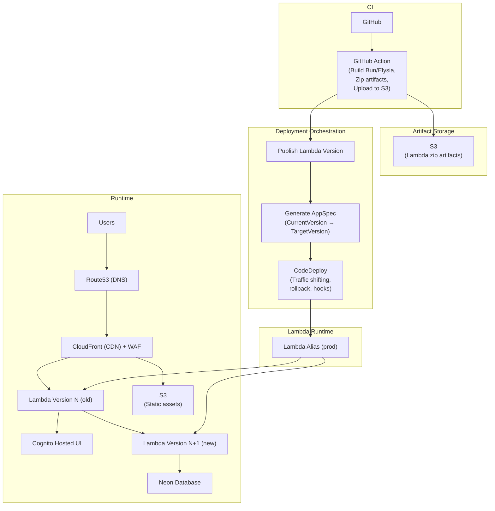
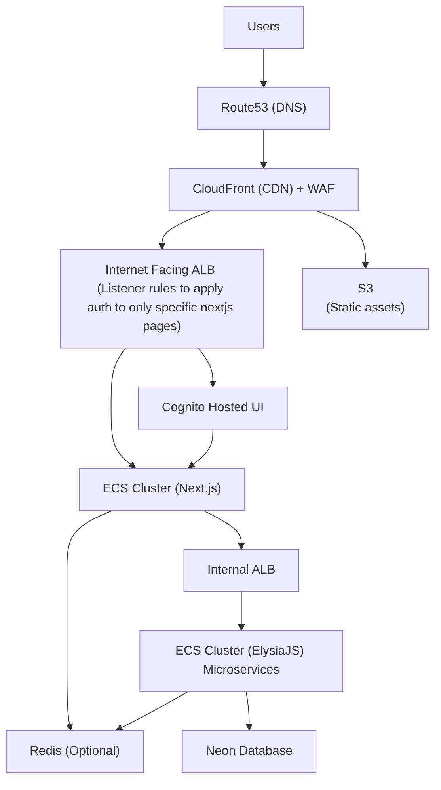
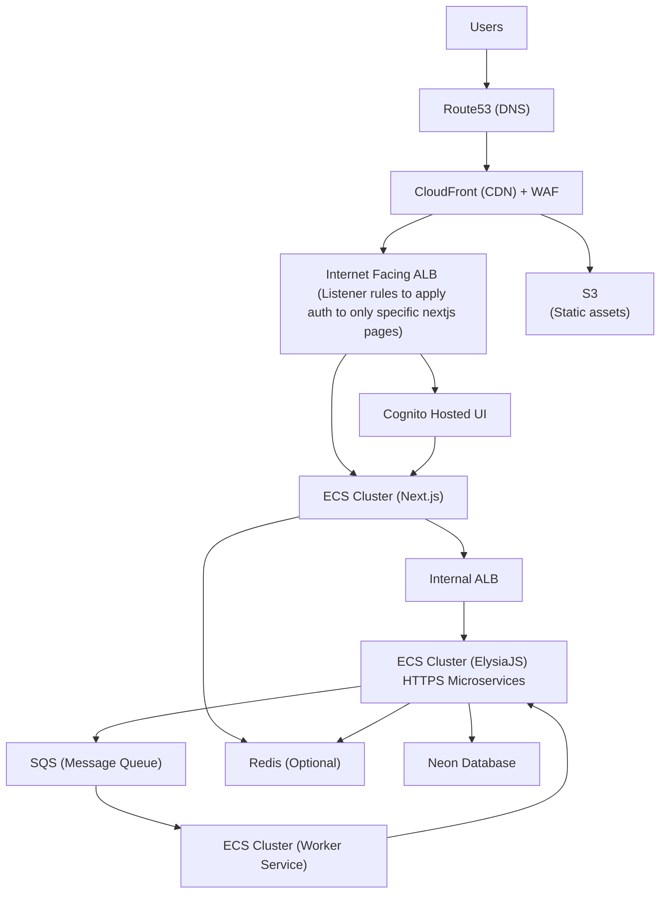

# AWS Architectures

3 production-ready AWS architectures :

1. Case: < 10 Monthly Users (Ultra Low Traffic / MVP)

2. Case: > 3000 Monthly Users (Growing Startup)

3. Case: > 10000 Monthly Users (High Traffic / Enterprise)

