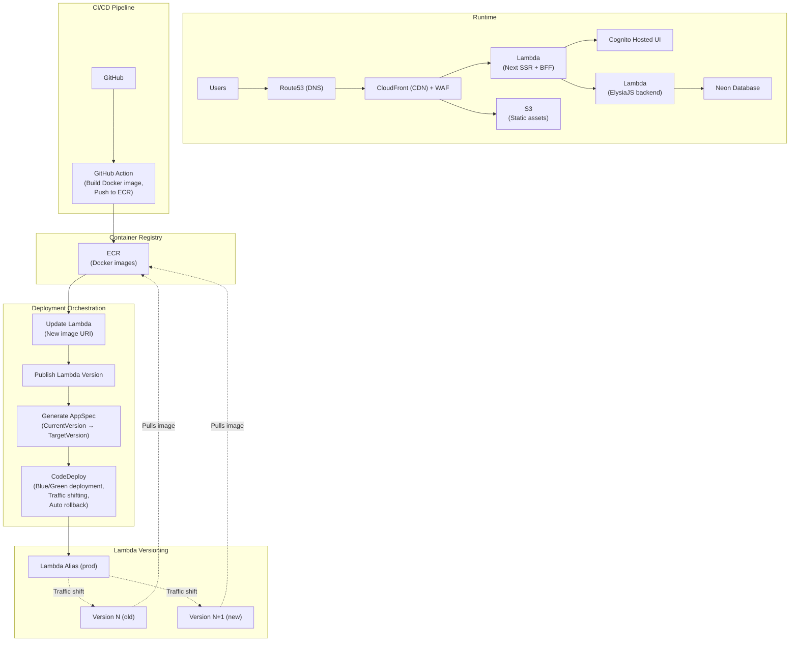
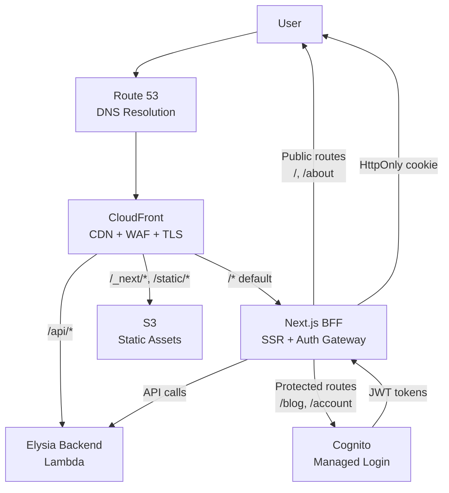
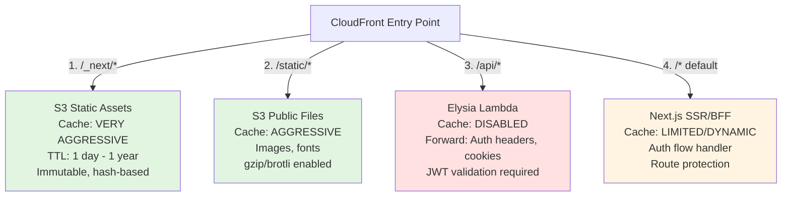
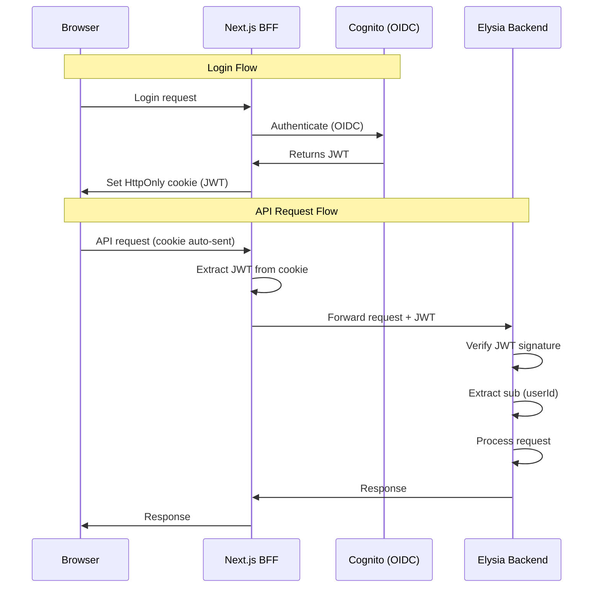
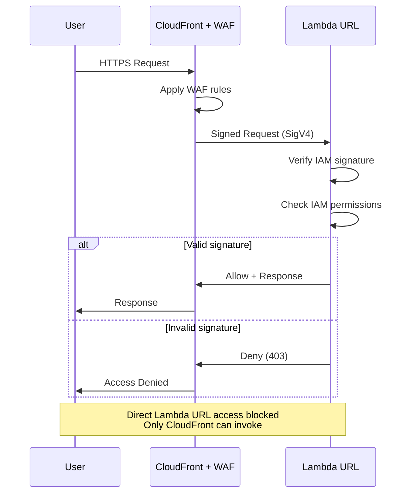
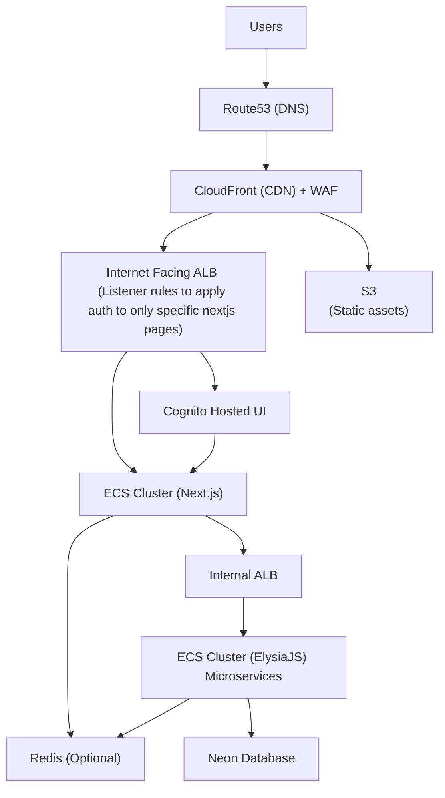
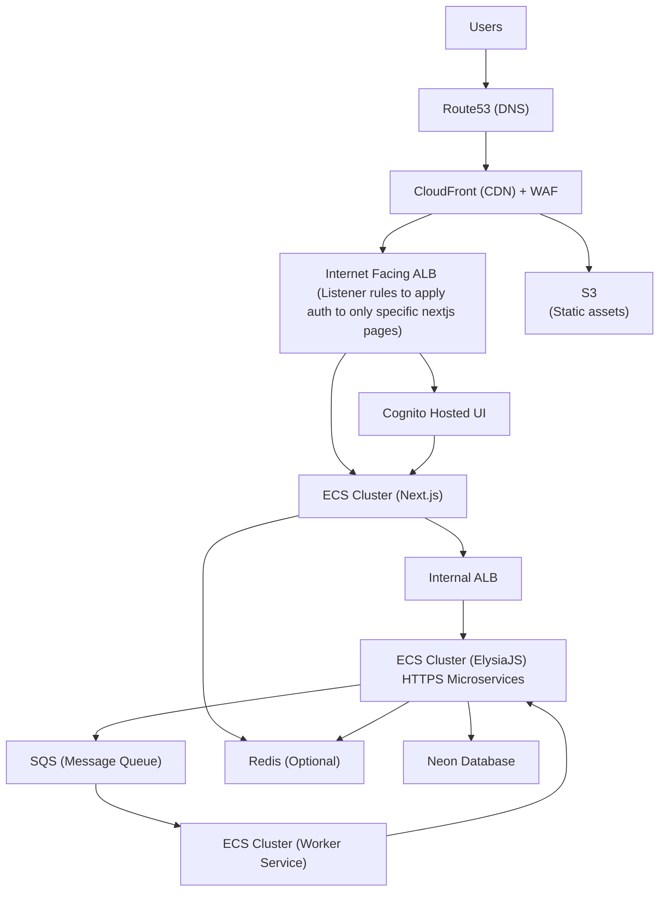

# AWS Architectures

3 production-ready AWS architectures :

1. Case: < 10 Monthly Users (Ultra Low Traffic / MVP)

**Request Routing Architecture:**

**CloudFront Path Behavior Priority:**

**Stateless Authentication Flow:**

**Request Flow Examples:**

### Public Homepage (/)
1. Browser → Route 53 → CloudFront
2. CloudFront applies cache behavior for `/`
3. Forwards to Next.js origin if needed
4. Next.js returns homepage (no auth required)
5. CloudFront caches and returns response

### Protected Route (/blog) - Unauthenticated
1. Browser → Route 53 → CloudFront → Next.js
2. Next.js checks auth cookie (not found)
3. Next.js redirects to Cognito authorization endpoint
4. Browser → Cognito Managed Login
5. User signs in
6. Cognito → `/auth/callback` with authorization code
7. Next.js exchanges code for JWT tokens
8. Next.js stores JWT in HttpOnly cookie
9. Next.js redirects to `/blog`
10. Browser requests `/blog` again (with cookie)
11. Next.js serves protected page

### Authenticated API Request
1. Browser → Route 53 → CloudFront → Next.js
2. Next.js reads auth cookie (server-side)
3. Next.js calls Elysia with JWT
4. Elysia validates JWT, extracts `sub` (userId)
5. Elysia processes request, returns data
6. Next.js renders page, returns through CloudFront

**Architecture Best Practices:**

1. **Application-Layer Auth**: Let Next.js BFF decide which routes require login. Don't force Cognito at the edge for the entire site.

2. **CloudFront Caching Strategy**:
   - `/_next/static/*` → Cache heavily (immutable assets)
   - `/images/*`, `/static/*` → Cache heavily (public assets)
   - `/auth/*` → No caching
   - `/blog`, `/account` → Dynamic/minimal caching
   - `/api/*` → No caching, forward auth headers/cookies

3. **Path Behavior Order**: CloudFront processes the first matching pattern. Order matters for security - broader patterns placed earlier can bypass stricter rules.

4. **Security**: 
   - WAF at CloudFront edge
   - JWT validation in Elysia backend
   - HttpOnly cookies (never localStorage)
   - IAM-signed requests from CloudFront to Lambda

**CloudFront to Lambda Security:**

2. Case: > 3000 Monthly Users (Growing Startup)

3. Case: > 10000 Monthly Users (High Traffic / Enterprise)

