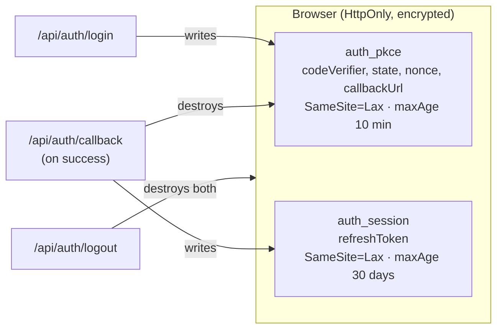
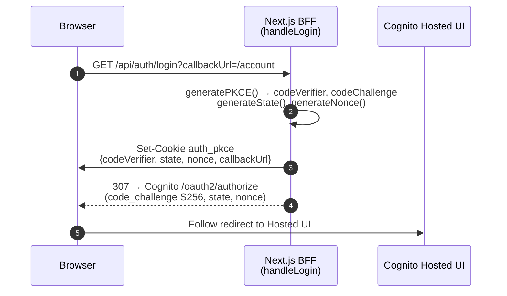
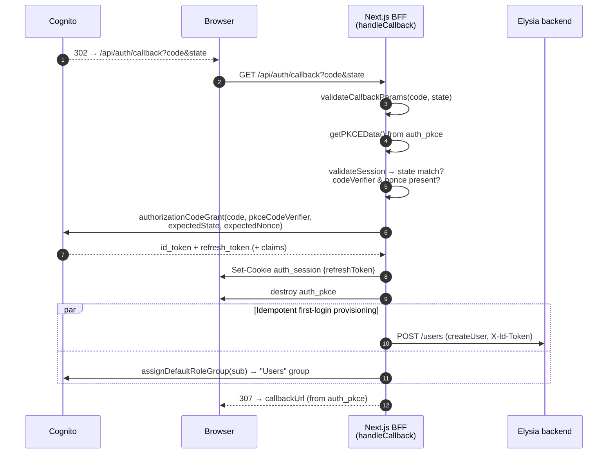
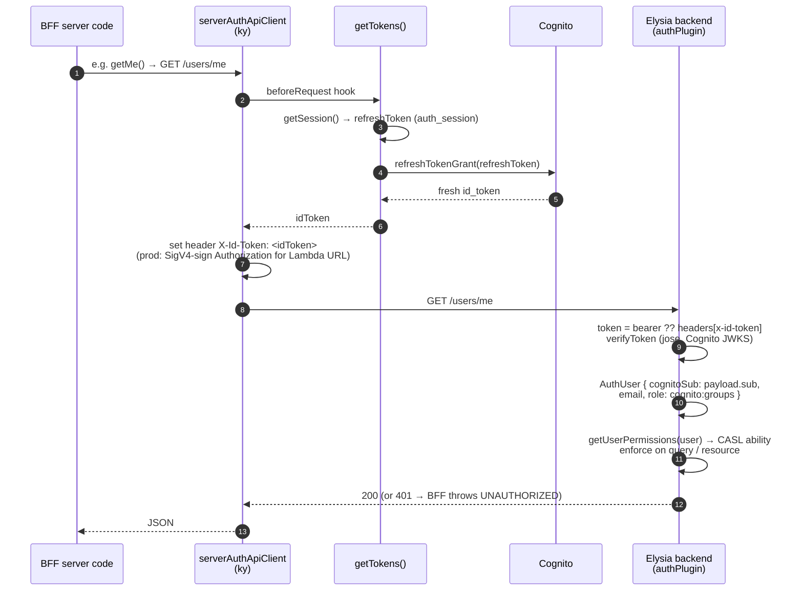
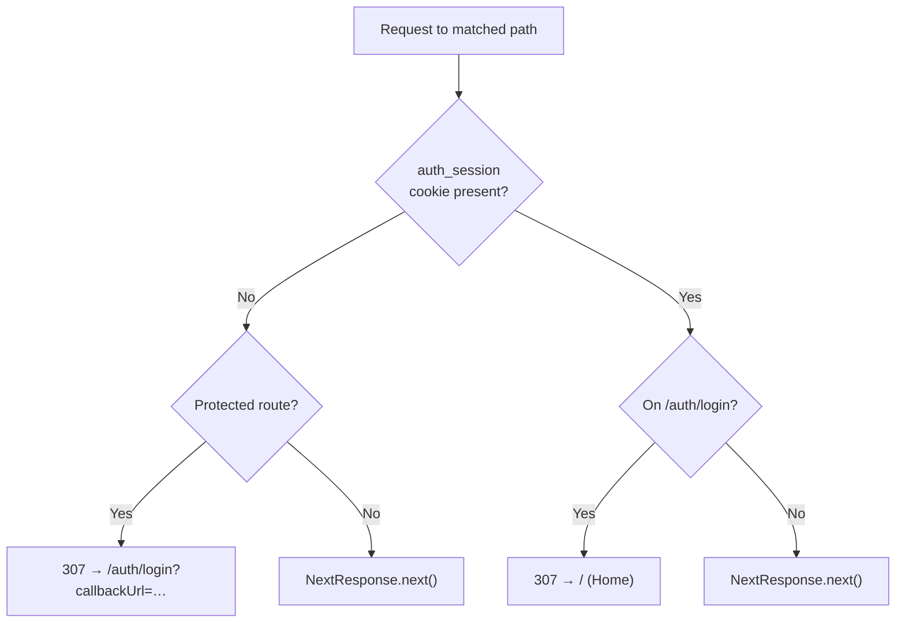
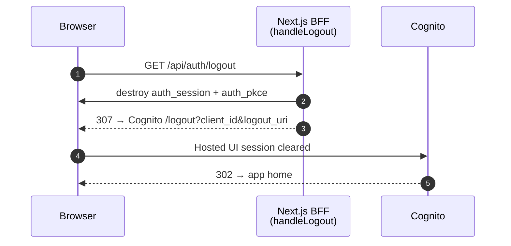

# Authentication & Authorization Flow

How a user goes from anonymous to authenticated, how the Next.js BFF makes
authenticated calls to the Elysia backend, and how the two apps enforce
authorization. This is the **implementation-level** companion to the
deployment view in [`architecture.md`](./architecture.md) (CloudFront → Lambda
→ Cognito → Neon).

The auth system is **OIDC (Authorization Code + PKCE) against AWS Cognito**,
fronted by the Next.js app acting as a **BFF**. The browser never holds Cognito
tokens — it only ever holds an encrypted, HttpOnly session cookie. The BFF
holds the long-lived refresh token server-side and mints short-lived ID tokens
on demand for each backend call.

## The two cookies

Both are [`iron-session`](https://github.com/vvo/iron-session) cookies (AEAD
encrypted, HttpOnly), but they have opposite lifetimes and meanings. Keeping
them separate is deliberate — conflating them let a half-finished login look
like a real session (see [Design notes](#design-notes)).

| Cookie | Holds | Written by | Lifetime | Meaning of presence |
| --- | --- | --- | --- | --- |
| `auth_pkce` | `codeVerifier`, `state`, `nonce`, `callbackUrl` | `handleLogin` (login initiated) | ~10 min | A login handshake is in progress |
| `auth_session` | `refreshToken` **only** | `handleCallback` (login completed) | 30 days | A completed, authenticated session |

`auth_session` stores nothing but the refresh token. Identity (`sub`, `email`)
is **not** persisted — it is read from a freshly-minted ID token's claims or
from `getMe()` whenever needed, so there is no stale copy to keep in sync.

Config: `constants/cookie.ts` (`COOKIE_OPTIONS`, `PKCE_COOKIE_OPTIONS`) and
`constants/session.ts` (`SESSION_CONFIG`, `PKCE_CONFIG`).

## 1. Login initiation

`GET /api/auth/login?callbackUrl=…` → `handleLogin`. Generates PKCE material,
stashes it in `auth_pkce`, and redirects the browser to the Cognito Hosted UI.
No `auth_session` is written here — nothing is authenticated yet.

## 2. Callback (token exchange)

Cognito redirects back to `GET /api/auth/callback?code=…&state=…` →
`handleCallback`. The BFF validates the returned `state`/`nonce` against
`auth_pkce`, exchanges the code for tokens, then **writes the real session and
destroys the PKCE cookie**. Only after a successful exchange does
`auth_session` exist.

If validation fails at any step the BFF redirects to
`/auth/login?error=…` instead of writing a session.

## 3. Authenticated backend call

Server-side BFF code (route handlers, server components) calls the Elysia API
through `serverAuthApiClient`. Its `beforeRequest` hook trades the stored
refresh token for a fresh ID token and attaches it as `X-Id-Token`. The backend
verifies the JWT and derives the user identity **from the token's claims** —
the userId is never sent as a separate field.

Order matters in production: the ID-token hook must run **before** the SigV4
`signingHook`, because SigV4 claims the `Authorization` header for the AWS
signature — hence the ID token rides in `X-Id-Token`. See the comments in
`lib/serverApiClient.ts`.

## 4. Edge route protection

`proxy.ts` (Next.js middleware) gates `PROTECTED_ROUTES` on the **presence** of
`auth_session` — it never decrypts the cookie. This is a cheap defense-in-depth
routing guard; real token verification happens in the backend (step 3). Because
in-flight PKCE state lives in `auth_pkce`, presence of `auth_session` reliably
means "completed session."

## 5. Logout

`GET /api/auth/logout` → `handleLogout`. Destroys both cookies and redirects to
the Cognito logout endpoint so the Hosted UI session is cleared too.

## Authorization (CASL)

Authentication answers "who are you"; authorization answers "what may you do".
Both apps mirror the same CASL model:

- **Backend** (`modules/auth/permission.ts`): `getUserPermissions(user, userId)`
  builds an `AppAbility` from the user's Cognito groups. Services enforce it —
  `accessibleBy(ability).ofType('<Model>')` in list `where` clauses and
  `ability.can('<action>', subject('<Model>', record))` on single resources.
  Unauthenticated callers get read-only public permissions.
- **Frontend** (`lib/casl.ts`, `PermissionProvider`): the same rules drive UI
  gating via `@casl/react`.

## Key files

| Concern | File |
| --- | --- |
| Session/PKCE schemas | `features/auth/schemas/auth.schema.ts` |
| Cookie & iron-session config | `features/auth/constants/{cookie,session}.ts` |
| Session cookie accessors | `features/auth/server/services/session.ts` |
| Login / callback / logout logic | `features/auth/server/services/auth.ts` |
| Refresh-token → ID-token exchange | `features/auth/server/services/token.ts` |
| PKCE generators | `features/auth/utils/pkce.ts` |
| Route handlers | `app/api/auth/{login,callback,logout}/route.ts` |
| BFF → backend clients | `lib/serverApiClient.ts` |
| Edge route guard | `proxy.ts` |
| Backend JWT verification | `apps/backend-boilerplate/src/modules/auth/auth.plugin.ts` |
| CASL permissions | `modules/auth/permission.ts` (both apps) |

## Design notes

- **Two cookies, not one.** An earlier version stored PKCE state and the session
  in a single `auth_session` cookie. Because `proxy.ts` checks only presence,
  merely *starting* a login (which wrote the cookie) looked authenticated —
  soft-locking the login page and letting half-authenticated visitors past the
  edge guard. Splitting PKCE into its own short-lived `auth_pkce` cookie fixes
  this and keeps the edge check presence-only. **Do not merge them back.**
- **Store only the refresh token.** `auth_session` deliberately holds nothing
  but `refreshToken`. The userId (`sub`) and email are always available from the
  minted ID token's claims or `getMe()`, so persisting them would only create a
  second, staleable source of truth.
- **Edge stays presence-only.** The middleware never decrypts the session; it is
  a routing convenience, not the security boundary. The backend's JWT
  verification is the real gate.
- **Stateless backend.** The Elysia API keeps no session state — every request
  carries a verifiable Cognito ID token, so it scales horizontally behind the
  Lambda Function URL.
