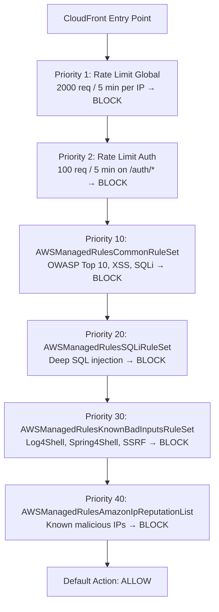

# WAF Implementation Plan

This guide covers adding AWS WAFv2 in front of the existing CloudFront distribution. WAF sits at the CloudFront edge and filters every request before it reaches any origin (frontend Lambda, backend Lambda, or S3).

---

## Overview

| Layer | What changes |
|---|---|
| Terraform modules | New `waf` module (`infra/terraform/modules/waf/`) |
| Terraform environments | `dev/main.tf`: add `module "waf"` block |
| Terraform modules | `cloudfront` module: accept `web_acl_id` variable and wire it to the distribution |

> **Important:** WAFv2 for CloudFront **must** use `scope = "CLOUDFRONT"` and **must** be provisioned in `us-east-1` regardless of where your other resources live. This requires a provider alias.

---

## Rule Priority Order

Each request is evaluated in ascending priority order. Lower number = evaluated first.



---

## Step 1 — Add provider alias for us-east-1

WAFv2 with `scope = "CLOUDFRONT"` must be in `us-east-1`. Add an alias provider to the dev environment.

### `infra/terraform/environments/dev/providers.tf`

```hcl
provider "aws" {
  region = var.aws_region
}

# WAFv2 for CloudFront must be provisioned in us-east-1
provider "aws" {
  alias  = "us_east_1"
  region = "us-east-1"
}
```

---

## Step 2 — Create the `waf` module

### `infra/terraform/modules/waf/variables.tf`

```hcl
variable "name_prefix" {
  description = "Prefix for all resource names"
  type        = string
}

variable "tags" {
  description = "Tags to apply to resources"
  type        = map(string)
  default     = {}
}
```

### `infra/terraform/modules/waf/main.tf`

```hcl
# -------------------
# WAF Web ACL — CloudFront scope (must be us-east-1)
# -------------------
resource "aws_wafv2_web_acl" "this" {
  name        = "${var.name_prefix}-waf"
  description = "WAF for CloudFront distribution"
  scope       = "CLOUDFRONT"

  default_action {
    allow {}
  }

  # -------------------
  # Rule 1: Global rate limit — blocks IPs sending > 2000 req / 5 min
  # Protects against DDoS and scraping
  # -------------------
  rule {
    name     = "rate-limit-global"
    priority = 1

    action {
      block {}
    }

    statement {
      rate_based_statement {
        limit              = 2000
        aggregate_key_type = "IP"
      }
    }

    visibility_config {
      cloudwatch_metrics_enabled = true
      metric_name                = "${var.name_prefix}-rate-limit-global"
      sampled_requests_enabled   = true
    }
  }

  # -------------------
  # Rule 2: Auth endpoint rate limit — blocks IPs sending > 100 req / 5 min on /auth/*
  # Protects against brute-force login attempts
  # -------------------
  rule {
    name     = "rate-limit-auth"
    priority = 2

    action {
      block {}
    }

    statement {
      rate_based_statement {
        limit              = 100
        aggregate_key_type = "IP"

        scope_down_statement {
          byte_match_statement {
            search_string         = "/auth/"
            positional_constraint = "STARTS_WITH"

            field_to_match {
              uri_path {}
            }

            text_transformation {
              priority = 0
              type     = "LOWERCASE"
            }
          }
        }
      }
    }

    visibility_config {
      cloudwatch_metrics_enabled = true
      metric_name                = "${var.name_prefix}-rate-limit-auth"
      sampled_requests_enabled   = true
    }
  }

  # -------------------
  # Rule 10: AWS Common Rule Set — OWASP Top 10 (XSS, SQLi, LFI, RFI, etc.)
  # override_action = none {} enforces the rule group's own BLOCK actions
  # Start with count {} in production and switch to none {} after monitoring
  # -------------------
  rule {
    name     = "aws-managed-common"
    priority = 10

    override_action {
      none {}
    }

    statement {
      managed_rule_group_statement {
        name        = "AWSManagedRulesCommonRuleSet"
        vendor_name = "AWS"
      }
    }

    visibility_config {
      cloudwatch_metrics_enabled = true
      metric_name                = "${var.name_prefix}-aws-managed-common"
      sampled_requests_enabled   = true
    }
  }

  # -------------------
  # Rule 20: SQL Injection — deep SQLi detection beyond CommonRuleSet
  # -------------------
  rule {
    name     = "aws-managed-sqli"
    priority = 20

    override_action {
      none {}
    }

    statement {
      managed_rule_group_statement {
        name        = "AWSManagedRulesSQLiRuleSet"
        vendor_name = "AWS"
      }
    }

    visibility_config {
      cloudwatch_metrics_enabled = true
      metric_name                = "${var.name_prefix}-aws-managed-sqli"
      sampled_requests_enabled   = true
    }
  }

  # -------------------
  # Rule 30: Known Bad Inputs — Log4Shell, Spring4Shell, SSRF patterns
  # -------------------
  rule {
    name     = "aws-managed-known-bad-inputs"
    priority = 30

    override_action {
      none {}
    }

    statement {
      managed_rule_group_statement {
        name        = "AWSManagedRulesKnownBadInputsRuleSet"
        vendor_name = "AWS"
      }
    }

    visibility_config {
      cloudwatch_metrics_enabled = true
      metric_name                = "${var.name_prefix}-aws-managed-known-bad-inputs"
      sampled_requests_enabled   = true
    }
  }

  # -------------------
  # Rule 40: Amazon IP Reputation List — known malicious IPs (botnets, scanners)
  # -------------------
  rule {
    name     = "aws-managed-ip-reputation"
    priority = 40

    override_action {
      none {}
    }

    statement {
      managed_rule_group_statement {
        name        = "AWSManagedRulesAmazonIpReputationList"
        vendor_name = "AWS"
      }
    }

    visibility_config {
      cloudwatch_metrics_enabled = true
      metric_name                = "${var.name_prefix}-aws-managed-ip-reputation"
      sampled_requests_enabled   = true
    }
  }

  visibility_config {
    cloudwatch_metrics_enabled = true
    metric_name                = "${var.name_prefix}-waf"
    sampled_requests_enabled   = true
  }

  tags = var.tags
}

# -------------------
# WAF Logging — logs blocked requests to CloudWatch
# Log group name MUST start with "aws-waf-logs-"
# -------------------
resource "aws_cloudwatch_log_group" "waf" {
  name              = "aws-waf-logs-${var.name_prefix}"
  retention_in_days = 30

  tags = var.tags
}

resource "aws_wafv2_web_acl_logging_configuration" "this" {
  log_destination_configs = [aws_cloudwatch_log_group.waf.arn]
  resource_arn            = aws_wafv2_web_acl.this.arn

  # Only log blocked requests to reduce noise and cost
  logging_filter {
    default_behavior = "DROP"

    filter {
      behavior    = "KEEP"
      requirement = "MEETS_ANY"

      condition {
        action_condition {
          action = "BLOCK"
        }
      }
    }
  }
}
```

### `infra/terraform/modules/waf/outputs.tf`

```hcl
output "web_acl_arn" {
  description = "ARN of the WAFv2 Web ACL — pass this to the CloudFront module"
  value       = aws_wafv2_web_acl.this.arn
}
```

---

## Step 3 — Update the `cloudfront` module to accept WAF

### `infra/terraform/modules/cloudfront/variables.tf`

Add:

```hcl
variable "web_acl_id" {
  description = "ARN of the WAFv2 Web ACL to associate with this distribution (must be CLOUDFRONT scope, us-east-1)"
  type        = string
  default     = null
}
```

### `infra/terraform/modules/cloudfront/main.tf`

Add `web_acl_id` to `aws_cloudfront_distribution.this`:

```hcl
resource "aws_cloudfront_distribution" "this" {
  enabled             = true
  is_ipv6_enabled     = true
  comment             = "CloudFront distribution"
  default_root_object = ""
  price_class         = "PriceClass_200"
  web_acl_id          = var.web_acl_id   # <-- add this line

  # ... rest of the distribution config unchanged
}
```

---

## Step 4 — Wire everything in `dev/main.tf`

```hcl
module "waf" {
  source = "../../modules/waf"

  providers = {
    aws = aws.us_east_1   # WAFv2 CloudFront scope must be us-east-1
  }

  name_prefix = local.name_prefix

  tags = merge(
    local.common_tags,
    {
      Name = "${local.name_prefix}-waf"
    }
  )
}

module "cloudfront" {
  source = "../../modules/cloudfront"

  # ... existing inputs unchanged ...

  web_acl_id = module.waf.web_acl_arn   # <-- add this
}
```

---

## Step 5 — Deploy

```bash
# Initialize to pick up the new module and provider alias
terraform init

# Review the plan — expect: 3 to add (aws_wafv2_web_acl, aws_cloudwatch_log_group, aws_wafv2_web_acl_logging_configuration)
# and 1 to change (aws_cloudfront_distribution — web_acl_id added)
terraform plan

terraform apply
```

---

## Step 6 — Verify

After apply, confirm WAF is attached:

```bash
aws cloudfront get-distribution-config \
  --id E3GJWARURCZ8R0 \
  --query 'DistributionConfig.WebACLId' \
  --output text
```

Expected output: the WAF ACL ARN.

Check CloudWatch for WAF metrics under the namespace `AWS/WAFV2` with metric names matching `${name_prefix}-*`.

---

## Cost Note

| Component | Approximate cost |
|---|---|
| Web ACL | $5.00 / month |
| Rule (per rule) | $1.00 / month each |
| Requests processed | $0.60 per 1M requests |
| Bot Control rule | Additional ~$10 / month (excluded from this plan) |

The rules in this plan (4 managed + 2 custom rate limits = 6 rules) cost roughly **$11/month base** plus request volume. Bot Control (`AWSManagedRulesBotControlRuleSet`) is intentionally omitted as it carries additional per-request charges on top; add it when traffic justifies the cost.

---

## OWASP Coverage by Rule

| OWASP Category | Covered by |
|---|---|
| A01 Broken Access Control | `AWSManagedRulesCommonRuleSet` (path traversal) |
| A03 Injection (SQLi) | `AWSManagedRulesSQLiRuleSet` + `AWSManagedRulesCommonRuleSet` |
| A03 Injection (XSS) | `AWSManagedRulesCommonRuleSet` |
| A05 Security Misconfiguration | `AWSManagedRulesKnownBadInputsRuleSet` (Log4Shell) |
| A07 Identification & Auth Failures | `rate-limit-auth` (brute-force protection) |
| A09 Security Logging & Monitoring | WAF logging to CloudWatch |
| Reputation / Botnets | `AWSManagedRulesAmazonIpReputationList` |
| DDoS / Flooding | `rate-limit-global` |

---

## Production Rollout Strategy

When deploying to a new environment or adding new managed rule groups, **always start in COUNT mode** to avoid false positives:

1. Set `override_action { count {} }` on all managed rule groups
2. Deploy and monitor CloudWatch WAF metrics for 1–2 weeks
3. Identify any false positives in the blocked request logs
4. Switch to `override_action { none {} }` rule by rule, starting with `AWSManagedRulesAmazonIpReputationList` (lowest false-positive risk) and ending with `AWSManagedRulesCommonRuleSet` (highest)
